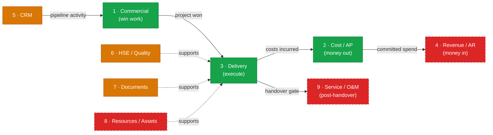

# Contractor business-spine map & roadmap (owner-requested guideline, 2026-06-11)

## 1. Purpose

The PMO Portal was prototyped against an oil & gas framing and is being generalized into a
**general project-contractor SaaS** — any org that wins work competitively, delivers it as a
finite project, and bills the client for that delivery. The exemplar used to ground this
analysis is a **solar EPC firm** (Engineering → Procurement → Construction), but the model
applies equally to civil, MEP, facilities, and any professional-services contractor.

This document is the **durable home of the spine model**: what the 9 core business processes
are, which are built, which are missing, how they relate, and the recommended build sequence.
It is a **strategic/orientation reference**, not a status tracker. The live status of open
work, deferred items, and the next-build queue lives in **`docs/backlog.md`** — read that
first for current state.

---

## 2. The 9-spine model

### Status table

| # | Spine | What it covers | Status |
|---|---|---|---|
| 1 | **Commercial** | Win the work: pipeline / tenders / win-rate | ✅ built & hardened |
| 2 | **Cost / AP** | Money OUT: budgets, procure-to-pay, timesheets | ✅ built & hardened |
| 3 | **Delivery** | Do the work: execution phases (E→P→C), %-complete / schedule, field ops | ✅ built (#74/#79/#80 — milestones, delivery-%, committed-spend; no stage-gates per OD-DEL-6) |
| 4 | **Revenue / AR** | Money IN: progress billing, retention, change orders, cashflow | ❌ missing (recommended next big spine) |
| 5 | **CRM** | Contacts, activity log, follow-ups | 🟡 thin |
| 6 | **HSE / Quality** | Incidents ✓; inspections / NCRs / permits ✗ | 🟡 partial |
| 7 | **Documents** | Register + approval ✓; **file upload ✓ (#78)**; transmittals / RFIs ✗ | 🟡 advancing |
| 8 | **Resources / Assets** | Capacity planning, equipment, inventory | ❌ missing |
| 9 | **Service / O&M** | Post-handover: recurring service contracts, preventive-maintenance schedules, breakdown tickets / SLAs, installed-asset registry, renewals + recurring billing | ❌ missing |

### Core-loop flowchart



> **Note — cross-cutting infra** (Reports, RBAC config engine, multi-tenancy, file storage)
> are NOT spines — they are platform concerns tracked in `docs/backlog.md`.
>
> **Spine 9 (Service / O&M)** is industry-variable (solar O&M, facilities maintenance,
> equipment service). It is NOT part of spine 3 (Delivery): Delivery is finite and ends at
> commissioning / handover; O&M is recurring. The **handover gate** is the birth event of the
> O&M contract and the installed-asset record. Spine 9 depends on spine 4 (recurring billing)
> and spine 8 (asset registry).

---

## 3. Gap detail

### Workaround tier — fakeable with conventions, and where it breaks

- **E/P/C phases as task-name prefixes** (`[ENG] detail design`, `[PROC] panel PO`,
  `[CON] mounting`): works for filtering by eye. Breaks: no per-phase rollup or % complete,
  no gate ("don't start Construction before Engineering issued-for-construction"), no phase
  dates / baseline; dashboards can't say "Project X is 60% through Procurement". `tasks`
  has only name / dates / assignee / status.

- **Design-deliverable register via `project_documents`**: category="Drawing", revision,
  Issued/Approved workflow — a credible IFC register. Breaks: no actual files (Storage
  disabled), no transmittals, no ball-in-court / due-date, no client-response tracking (an
  RFI faked as a document has no "answered" loop).

- **Subcontractors as `companies.type='Vendor'` + a procurement**: a subcontract = a big PR.
  Breaks: no retention, no progress claims against the subcontract, no insurance / compliance
  fields (`companies` has only name + type), no per-line GR matching (deferred, OD-PROC-2).

- **Change orders as a manual `contract_value` edit** (SoD-gated, `set_project_contract_value`):
  the number changes but there is no variation record, no client approval trail, no
  original-vs-revised — OD-MARGIN-2 explicitly seamed-not-built value history.

- **Field daily log as an `incident_reports` row of type "Daily log"**: abuses severity
  semantics; no crew / weather / quantities / photos.

- **Capacity planning via `profiles.utilization`**: a static smallint hand-typed by admin;
  no forward allocation, never derived from assignments or timesheets.

- **Client invoicing kept in Xero / spreadsheet**: viable for many SMB contractors, but
  then margin on-hand (`contract_value − spent`) never reflects billed / collected reality —
  no earned-vs-billed.

### Gap tier — ranked

Legend: delta size S/M/L (schema + UI combined); "tracked" = already in `docs/backlog.md`
DEFERRED or an OD-* seam — listed for completeness, not re-litigated.

| # | Gap | Why contractors need it (general) | Delta | Seam it extends | Tracked? |
|---|---|---|---|---|---|
| 1 | **Execution phases / stage-gates** | Post-win, `status` collapses to Ongoing/On Hold/Close Out — no E→P→C (or any) delivery decomposition; gates (design approved before procurement, mobilization before construction) are the contractor's core control loop | **M** schema (`project_phases` org-configurable template + per-project instances with gate status), M UI (phase strip on ProjectDetail, mirrors the existing LifecycleStepper) | `projects` + groups `tasks`; the pipeline stepper pattern is reusable | NEW |
| 2 | **WBS / schedule / % complete / Gantt / baseline** | Flat tasks can't answer "are we on schedule?" — no hierarchy / rollup, no % complete, no baseline-vs-actual, no critical path; `task_dependencies` exists but nothing consumes it | **M** schema (tasks: `parent_id`, `phase_id`, `percent_complete`, `baseline_start/end`, sort), **L** UI (Gantt; recharts won't cut it — dedicated component) | `tasks` (direct column adds) + `task_dependencies` (finally used) | NEW |
| 3 | **Progress billing / payment applications + retention** | The entire AR side is absent: contractors bill against milestones or % complete, with retention held / released; cash dies without it — mirror image of the existing procure-to-pay | **L** (new domain: billing milestones / payment applications with status machine, retention %, client-invoice records; SoD like `transition_procurement`) | NEW domain; consumes gaps 1 & 2 (%-complete basis); feeds the tracked cashflow / commitment-governance track (OD-W5-5) | NEW (cashflow half = tracked) |
| 4 | **Change orders / contract variations** | Scope change is the #1 margin event in contracting; needs a variation record (proposed→approved→rejected, value delta, client ref) updating revised contract value + budget | **M** (new `change_orders` table + RPC stamping `contract_value`; OD-MARGIN-2 already seams value history) | `projects.contract_value` (+ budget version link); reuses transition-RPC pattern (ADR-0012) | NEW (OD-MARGIN-2 = seam only) |
| 5 | **Cost codes vs 7 fixed categories** | 7 enum categories (OD-BUDGET-4, locked) are portfolio-level; contractors estimate / control at cost-code grain (per phase / discipline / work package) and need procurement + labor actuals rolled to the code | **M** (enum→org-scoped lookup per the OD-BUDGET-4 seam; `budget_line_items.cost_code`; procurement-line→code mapping = the deferred OD-BUDGET-2 rollup) | `budget_line_items` + `procurement_items`; explicitly seamed | Partially tracked (OD-BUDGET-4/2 deferrals + OD-PROC-6 config bridge) |
| 6 | **CRM completion: contacts, activity log, follow-ups** | `companies` = name + type only; no people, no call / email / meeting log, no next-action — pipeline aging (migration 0020) detects neglect but offers no remedy loop | **S/M** (`contacts` table FK companies; `activities` polymorphic log on company/project; follow-up = due-dated activity) | `companies` + pipeline records; PipelineLens gets a timeline panel; aligns with deferred Model A (`opportunities`) end-state — do not re-litigate ADR-0020 | NEW (Model A = tracked deferred) |
| 7 | **Field daily logs / site reports** | Daily proof-of-progress (crew counts, weather, work done, quantities, photos) is contractual evidence for claims / disputes — universal in field contracting | **S** schema (`daily_logs` per project/date/author + lines), **M** UI (mobile-first form; Wave-4 mobile work helps) | New table beside `incident_reports` (same shape / RLS recipe); photos need tracked Storage | NEW (photo half blocked on tracked file-upload) |
| 8 | **Subcontract management** | A subcontract is not a PO: progress claims against committed value, retention held, insurance / license expiry, back-charges; today it is a budget category + a Vendor company | **M** (subcontract entity or `procurements` subtype with claim schedule + retention; company compliance fields) | `procurements` (subtype) + `companies` (compliance) + gap 3 (retention mechanics shared) | NEW |
| 9 | **RFI / submittal workflows** | Question-answer loops with the client / engineer-of-record carry schedule risk (ball-in-court, due, overdue); `project_documents` SoD status workflow is 70% of a submittal already | **S/M** (RFI table: question/answer/ball-in-court/due; submittal = `project_documents` + transmittal / response fields) | `project_documents` workflow + doc-number minter (OD-PROC-3 pattern); files need tracked Storage | NEW |
| 10 | **Resource planning / capacity** | `profiles.utilization` is static; timesheets are actuals-only. Contractors need forward allocation (who is on which project / phase next month) vs capacity | **M** (`assignments` person × project (× phase) × period; derive utilization from assignments + timesheet actuals) | `profiles` + `tasks.assignee_id`; the backlog's "assigned-projects picker needs an assignment model" is the same model | Partially tracked |
| 11 | **Equipment / asset & inventory** | Field contractors track owned plant (allocation, maintenance) and materials stock (panels delivered vs installed); today "Equipment" is only a budget category, GR is header-only | **L** (two new domains: assets with allocation / maintenance; inventory with locations / movements) | NEW domain; GR per-line matching (deferred OD-PROC-2) is the procurement-side prerequisite | NEW (per-line GR = tracked deferral) |
| 12 | **Earned value / progress analytics** | EV (PV/EV/AC, CPI/SPI) is the standard contractor health metric; needs gaps 1 + 2 + 5 as inputs | **S** once inputs exist (read RPCs + dashboard tiles, OD-ARCH-1 aggregation rule) | Dashboard RPC layer (`get_executive_dashboard` pattern) | NEW (blocked on 1/2/5) |

**Already tracked — do not double-count as new scope:** commitment governance (PO-gate) +
cash-position domain (OD-W5-5, backlog "Bigger feature"); Admin RBAC config engine
(OD-PROC-6); Reports module; document file upload / Storage re-enable; expense claims
(OD-PROC-5); per-project PM timesheet approval (OD-TS-3); per-line GR matching
(OD-PROC-7 / OD-PROC-2); budget-category configurability (OD-BUDGET-4 seam); Model A
opportunities split (ADR-0020 deferred end-state).

---

## 4. Sequencing recommendation

### Top-5 tracks

**T1 — Delivery backbone: execution phases + WBS / % complete (+ schedule view).** Gaps 1 + 2.
This is the single biggest "is this a contractor tool or a sales tool?" divider: today the app
knows everything about winning and buying and nothing about *delivering*. Phases give stage-gates
and per-phase rollups; `percent_complete` + baseline on tasks gives schedule honesty; both reuse
proven seams (tasks columns, the LifecycleStepper UI, org-scoped config tables per OD-SP-2).
Everything downstream — progress billing basis, EV, daily-log context, capacity-by-phase — keys
off this. Sequence FIRST. (Gantt rendering can land as a later slice; phase strip + % rollup
is the MVP.)

**T2 — Revenue side: progress billing + retention + change orders.** Gaps 3 + 4. The app is
AP-complete and AR-absent — a contractor lives on monthly payment applications and dies on unbilled
variations. Change orders are the smaller, higher-leverage half (one table + one transition RPC in
the ADR-0012 mold, updating `contract_value` through the existing SoD seam) — ship them first;
payment applications follow, on the %-complete / milestone basis T1 provides. Spec jointly with
the already-tracked commitment-governance / cash-position track (OD-W5-5) — billing in-flows are
half of that cashflow model.

**T3 — Cost codes + actuals rollup (open the OD-BUDGET seams).** Gap 5. Locked decisions already
point here: OD-BUDGET-4 seams enum→org-scoped lookup; OD-BUDGET-2 defers procurement→category
rollup; OD-TS-3 defers timesheet→project-cost. Opening these three seams together turns
budget-vs-committed from a portfolio headline into per-code cost control — the contractor's
estimating feedback loop — and is the data prerequisite for EV (gap 12). Mostly backend + budget-
table UI; lowest UX risk of the five.

**T4 — CRM completion: contacts + activity timeline + follow-ups.** Gap 6. Cheapest track (two
small tables + a timeline panel), high daily-use payoff: the pipeline already detects neglected
deals (migration 0020 aging) but offers no log / next-action loop, and `companies` can't even hold
a phone number. Catalog pattern #101 (quick-log, activity timeline) is the exact UX target. Also
the natural forcing function for the deferred Model A opportunities split — build it Model-A-shaped
(activities polymorphic) so the extraction stays a lift, not a rewrite (ADR-0020 consequence note).

**T5 — Field operations: daily logs + RFI / submittals (after Storage).** Gaps 7 + 9. Both are
evidence workflows that monetize existing seams: daily logs clone the incident-register recipe;
RFIs / submittals extend the `project_documents` SoD status machine + the OD-PROC-3 number
minter. Both are half-blind without attachments, so the already-tracked Storage / file-upload
re-enable is the explicit prerequisite — schedule it as this track's step 0. Wave-4 mobile work
makes the field-entry surface viable at 375px.

**Spine 9 (Service / O&M):** after T2-billing + spine 8 (assets). Pull earlier only if a customer
retains service contracts alongside the delivery contract — in that case O&M spec can be written
in parallel with T2 and built once billing + asset-registry foundations are stable.

### Sequencing line

```
T1 → (T2-change-orders ∥ T3 ∥ T4) → T2-billing (needs T1 basis + tracked cashflow spec)
    → T5 (needs tracked Storage)
    → later: subcontracts gap-8 (needs T2 retention mechanics),
             capacity gap-10,
             equipment/inventory gap-11 (needs per-line GR),
             EV gap-12 (needs T1 + T3),
             spine-9 O&M (needs T2-billing + gap-11 assets)
```

Deliberately NOT recommended now: re-litigating Model B (ADR-0020 / 0021); the 7-category lock
(OD-BUDGET-4 — T3 goes through its seam); flat roles (OD-PROC-6 owns that); per-entry timesheet
approval (OD-TS-3 trigger is T3's billing / cost need, let it pull).

---

## 5. Decision log

**2026-06-11 (owner):** Next build program = **spine 3, Delivery backbone** (milestones + task
grouping + %-complete rollup). Delivery state lives on the canonical `/projects/:id` detail
page (ADR-0021) — milestone strip in the header area, milestone grouping on the Tasks tab,
delivery-% rollup chips on Projects list + dashboards; no new nav module. All structural
decisions are now locked: see **OD-DEL-2..7** in `docs/decisions.md` — milestones are
free-form per project (OD-DEL-2), two-level hierarchy only (OD-DEL-3), two-column calculated
+ input % (OD-DEL-4), weight-weighted project delivery % (OD-DEL-5), no stage-gates (OD-DEL-6),
PM + Admin writes (OD-DEL-7). Spec: `docs/specs/delivery-milestones.spec.md`.

**2026-06-11 (owner):** O&M = **spine 9**, distinct from Delivery. Rationale: Delivery is a
finite engagement ending at commissioning / handover. O&M is a recurring contract that begins
where Delivery ends. Conflating them would require the phase model to represent both a one-time
project lifecycle AND an ongoing maintenance cycle — two incompatible time shapes. The handover
gate is the explicit birth event of the O&M contract and the installed-asset record; spine 9
therefore has a hard dependency on spine 4 (recurring billing) and spine 8 (asset registry)
and is sequenced after them.

---

## 6. ERP/CRM pattern inspiration (ui-ux-pro-max catalog)

From the `products.csv` (161 product types) + `charts.csv` catalog; the 10 most relevant
patterns for the contractor generalization:

| Pattern (catalog source) | What it is | Extends vs new | UX note from the catalog |
|---|---|---|---|
| Construction/Architecture (#51) | Project-management dashboard: timeline, material specs, team | Extends ProjectDetail (gaps 1 + 2) | "Project Management Dashboard; Timeline; Material specs; Team collaboration" — grey + safety-orange + blueprint-blue accents |
| CRM & Client Management (#101) | Contact cards, pipeline kanban, activity timeline, quick-log (call/email/meeting), deal amount + probability | Extends SalesPipeline / PipelineLens + Companies (gap 6) | "Activity timeline. Quick-log. Tag/segment filter. Mobile quick-actions" — the quick-log affordance is the missing follow-up loop |
| Invoice & Billing (#105) | Line-item invoices, status badges Draft/Sent/Paid/Overdue, recurring, payment links | New AR domain (gap 3) | "Status badges + paid-green/overdue-red" — mirror of the existing procurement StatusPill language |
| Inventory & Stock (#102) | Stock-level badges, low-stock alerts, location filter, reorder trigger, audit log | New domain (gap 11) | "Functional neutral + traffic-light status"; batch edit + audit log |
| Productivity/PM tool (#16) | Task workflow with drill-down analytics dashboard | Extends tasks (gap 2) | "Clear hierarchy + functional colors; speed & efficiency" — supports the existing honest-doorway drill rule (OD-W5-C2-D) |
| Sales Intelligence Dashboard (#5 / #101 archetype) | Pipeline-stage-colored funnel + forecast | Exists (SalesPipeline) — extend with gap-6 activity data | Funnel chart for stage drop-off |
| Financial Dashboard (#6 archetype) | Real-time, red/green alert semantics | Extends FinanceDashboard with gap-3 AR aging | "High contrast, real-time updates" |
| Waterfall chart (charts.csv #13) | Cumulative variance bridge | Budget vs CO vs actuals view (gaps 4 + 5) | "P&L / budget variance" is its named use-case; ≤12 bars |
| Bullet/gauge KPI (charts.csv #8 / #18) | KPI vs target, compact multi-KPI | EV dashboard (gap 12): CPI/SPI vs 1.0 | "Multiple KPIs side-by-side; space-constrained" |
| Logistics/Delivery (#49) | Real-time tracking, route analytics | Distant-future field ops (gaps 7 + 11 delivery tracking) | Status-color tracking (blue/orange/green) — same traffic-light grammar |
